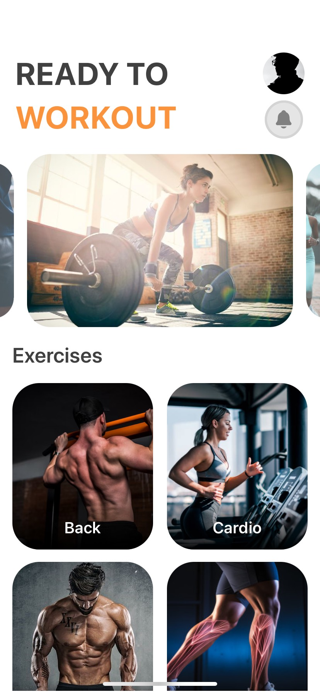

# Fitness App
This fitness app is a simple demonstration of React Native, featuring animations with React Native Reanimated and navigation with Expo Router. It was primarily developed for educational purposes to familiarize oneself with these technologies.

## Demo
<div style="display: flex">
  


</div>


## Features
* Basic navigation between screens using Expo Router.
* Simple fitness-related features and animations implemented with React Native Reanimated.

## Technologies Used
* React Native
* Expo Navigation
* React Native Reanimated
* NativeWind

## Installation

1. Clone the repository:
```
https://github.com/AGuardiola20/fitness-react-native.git
```

2. Change to the project directory
```
cd fitness-react-native
```

3. Install dependecies
```
npm install
```

4. Start the application
```
npm run web
```

5. Open the project with Expo Go
